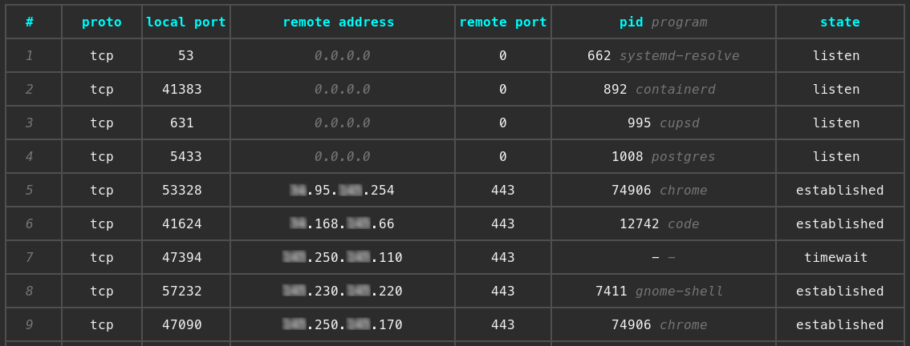
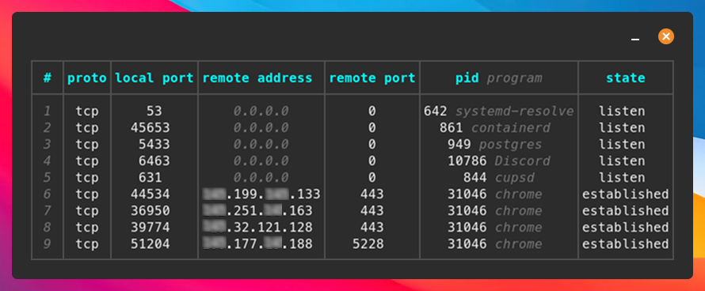

<p align="center">
  
</p>


### A human-friendly alternative to netstat for socket and port monitoring on Linux and macOS.

> [!NOTE]  
> The master branch code and readme may include features that are not yet released. For the official, stable version and its documentation, please refer to the [crates.io](https://crates.io/crates/somo) page.

## ✨ Highlights:
- pleasing to the eye thanks to a nice table view
- filterable and sortable output
- interactive killing of processes
- JSON and custom formattable output
- from ``netstat -tulpn`` to ``somo -l``
- cross-platform support for Linux and macOS
- you can find all features further down

<br />

<p align="center">
  
</p>

## ⬇️ Installation:

### Using cargo:
```sh
cargo install somo
```
Most of the time you will want to run this in ``sudo`` mode to see all processes and ports. To make that work, you can create a symlink so the binary can be run as root:
```sh
sudo ln -s ~/.cargo/bin/somo /usr/local/bin/somo
sudo somo   # this works now
```

##### Or install directly from GitHub:
*Warning:* This will install the cutting-edge development version and may be unstable or contain incomplete features.
```sh
cargo install --git https://github.com/theopfr/somo
```

### Debian:
If you use a Debian OS go to [releases](https://github.com/theopfr/somo/releases) and download the latest .deb release.

### Arch:
```sh
yay -S somo
```

### Nix:
*Warning:* This will install the cutting-edge development version and may be unstable or contain incomplete features.

You can build it using Nix with Flakes:
```sh
nix build 'github:theopfr/somo?dir=nix'
sudo ./result/bin/somo
```

---

## 🏃‍♀️ Running somo:
To run somo just type: 
```sh
somo  # or sudo somo
```

Somo supports the following features:

### ✨ Filtering:
You can use the following flags to filter based on different attributes:
| filter flag | description | value |
| :------------- |:------------- | :----- |
| ```--tcp, -t``` | filter by TCP connections | - |
| ```--udp, -u``` | filter by UDP connections  | - | 
| ```--proto``` | deprecated – use ``--tcp`` / ``--udp`` instead | ``tcp`` or ``udp`` | 
| ```--port, -p``` | filter by a local port | port number, e.g ``5433`` |
| ```--remote-port``` | filter by a remote port | port number, e.g ``443`` |
| ```--ip``` | filter by a remote IP | IP address e.g ``0.0.0.0`` |
| ```--program``` | filter by a client program | program name e.g ``chrome`` |
| ```--pid``` | filter by a PID | PID number, e.g ``10000`` |
| ```--open, -o``` | filter by open connections | - |
| ```--listen, -l``` | filter by listening connections | - |
| ```--established, -e``` | filter by established connections | - |
| ```--exclude-ipv6``` | deprecated – use ``--ipv4`` instead (mut. exclusive with ``--ipv6``) | - |
| ```--ipv4, -4``` | get only IPv4 connections (mut. exclusive with ``--ipv6``) | - |
| ```--ipv6, -6``` | get only IPv6 connections (mut. exclusive with ``--ipv4``) | - |

### ✨ Compact table view:
To get a smaller, more compact table use the ``--compact, -c`` flag.



### ✨ Process killing:
With the ``--kill, -k`` flag you can choose to kill a process after inspecting the connections using an interactive selection.

### ✨ JSON and custom output format:
Using the ``--json`` flag you can choose to retrieve the connection data in JSON format. <br />
You can also define a custom output format using the ``--format`` flag, for example:
```sh
somo --format "PID: {{pid}}, Protocol: {{proto}}, Remote Address: {{remote_address}}" # attributes must be specified in snake_case
```
In the format-string, the attributes have to be specified in *snake_case*.

### ✨ Sorting by columns:
The ``--sort, -s`` flag can be used to sort the table after a specific column ascending. For example:
```sh
somo --sort pid   # column names must be specified in snake_case
```
To get a descending order, you can use the ``--reverse, -r`` flag.

### ✨ Config file for setting default flags:
You can create a config file that defines flags to be automatically applied every time you run ``somo``.
- run ``somo generate-config-file`` to create the file
- run ``somo --config-file`` to print the path to the config file
- run ``somo --no-config`` to ignore all default flags

For example, if your config file looks like this:
```bash
# View compact version of the table
--compact
# Sort by PID
--sort=pid
```
then ``somo`` will always show the table in compact mode, sorted by PID.

### ✨ Displaying service names of ports:
When using the ``--annotate-remote-port, -a`` flag, the table will display the corresponding service names for the listed ports as defined by the *IANA Port Number Registry* (for example, ``443 -> https``).

---

## 🐚 Shell Completions:
Somo supports shell completions for bash, zsh, fish, and elvish. Choose your shell:

#### Bash:
```bash
mkdir -p ~/.local/share/bash-completion/completions
somo generate-completions bash > ~/.local/share/bash-completion/completions/somo
```

#### Zsh:
```bash
mkdir -p ~/.local/share/zsh/site-functions
somo generate-completions zsh > ~/.local/share/zsh/site-functions/_somo
echo 'fpath=(~/.local/share/zsh/site-functions $fpath)' >> ~/.zshrc
echo 'autoload -U compinit && compinit' >> ~/.zshrc
```

#### Fish:
```bash
mkdir -p ~/.config/fish/completions
somo generate-completions fish > ~/.config/fish/completions/somo.fish
```

#### Elvish:
```bash
mkdir -p ~/.config/elvish/lib
somo generate-completions elvish > ~/.config/elvish/lib/somo.elv
echo 'use somo' >> ~/.config/elvish/rc.elv
```

---

## 🖥️ Platform Support:
Somo currently supports:
- Linux: Full support using the [procfs](https://crates.io/crates/procfs) crate
- macOS: Full support using [netstat2](https://crates.io/crates/netstat2) and [libproc](https://crates.io/crates/libproc/0.13.0) crates
