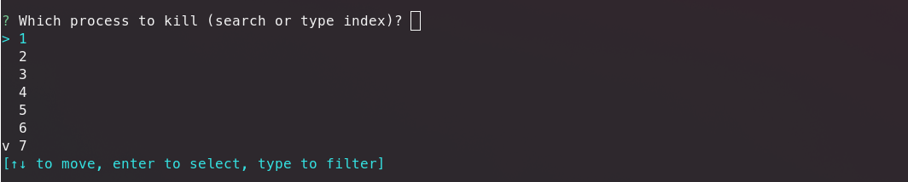
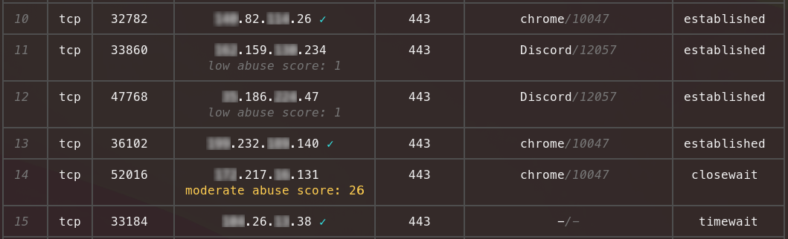

[](https://github.com/theopfr/somo/actions/workflows/cicd.yml)

# 🌏 Somo
### A human-friendly alternative to netstat or ss for socket monitoring with the ability to scan for malicious IP addresses.

---

## ⬇️ Installation:

### Debian:
If you use a Debian OS go to [releases](https://github.com/theopfr/somo/releases) and download the latest .deb release.

### From crates.io:
#### 1. Install cargo:
You can install cargo from the [crates.io](https://crates.io/) website.
#### 2. Install the somo crate:
```
cargo install somo
```
## 🏃‍♀️ Running somo:
To run somo just type: 
```
somo
```

#### Using sudo:
It can often be beneficial to run it in ``sudo`` mode since many PIDs will remain hidden otherwise. If ``sudo somo`` doesn't work, try running it using the full path:
```bash
# you can find out the path by running: "where somo"
sudo /path/to/somo
# or directly like this
sudo $(where somo)
```
Problems with this: it's unconvenient and ENV variables can't be accessed!
Better solution: Add it to the ``$PATH`` variable (like [this](https://opensource.com/article/17/6/set-path-linux)).

## ⚙️ Features:
### 1. Pretty and easily readable table:


### 2. Filtering:
You can filter by **remote port**, **local port**, **IP**, **protocol**, **client program**, **PID** and **connection status**.
Check the flag descriptions below.

### 3. Process killing:
With the ``-k`` flag you can choose to kill a process after inspecting the connections using an interactive selection option.


### 4. Checking for malicious IPs using [AbuseIPDB.com](https://www.abuseipdb.com/):
To automatically check if any of the remote IPs you are connected to are malicious you can specify an API key for the AbuseIPDB API as an environment variable:
```bash
export ABUSEIPDB_API_KEY={your-api-key} # not session persistent
```
Adding the ``-c`` flag will then check for malicious IPs and notify you in the table:


---

## 🚩 Flags:
| flag | description | value |
| :------------- |:------------- | :----- |
| ```--proto``` | filter by either TCP or UDP  | ``tcp`` or ``udp`` | 
| ```--ip``` | filter by a remote IP | the IP address e.g ``0.0.0.0`` |
| ```--port, -p``` | filter by a remote port | the port number, e.g ``443`` |
| ```--local-port``` | filter by a local port | the port number, e.g ``5433`` |
| ```--program``` | filter by a client program | the program name e.g ``chrome`` |
| ```--pid, -p``` | filter by a PID | the PID number, e.g ``10000`` |
| ```--open, -o``` | filter by open connections | - |
| ```--exclude-ipv6, -e``` | don't list IPv6 connections | - |
| ```--kill, -k``` | interactive process killing | - |
| ```--check, -c``` | check remote IPs using AbuseIPDB (make sure the environment variable ``ABUSEIPDB_API_KEY`` is set) | - |
