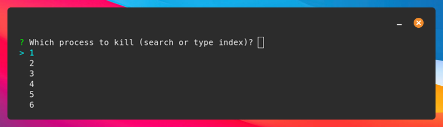

<div style="text-align: center;">
  
</div>

### SOMO: A human-friendly alternative to netstat for socket and port monitoring for Linux.

## ✨ Features:
- pleasing to the eye thanks to a nice table-view
- filterable (see filter-options below)
- interactive killing of processes
- from ``nestat -tulpn`` to ``somo -l`` (almost half the characters, can you believe it?)


---

## ⬇️ Installation:

### Option 1 - Debian:
If you use a Debian OS go to [releases](https://github.com/theopfr/somo/releases) and download the latest .deb release.

### Option 2 - From crates.io:
```
cargo install somo
```

---

## 🏃‍♀️ Running somo:
To run somo just type: 
```
somo
```

Most of the time you will want to run this in ``sudo`` mode, since otherwise much information will be hidden (same game as with ``netstat``).

### Filtering:

You can use the following flags to filter based on diffferent attributes:
| filter flag | description | value |
| :------------- |:------------- | :----- |
| ```--proto``` | filter by either TCP or UDP  | ``tcp`` or ``udp`` | 
| ```--port, -p``` | filter by a local port | port number, e.g ``5433`` |
| ```--remote-port``` | filter by a remote port | port number, e.g ``443`` |
| ```--ip``` | filter by a remote IP | IP address e.g ``0.0.0.0`` |
| ```--program``` | filter by a client program | program name e.g ``chrome`` |
| ```--pid, -p``` | filter by a PID | PID number, e.g ``10000`` |
| ```--open, -o``` | filter by open connections | - |
| ```--listen, -l``` | filter by open connections | - |
| ```--exclude-ipv6``` | don't list IPv6 connections | - |


### Process killing:
With the ``--kill, -k`` flag you can choose to kill a process after inspecting the connections using an interactive selection option.


You can of course also apply filters and the kill-flag at the same time:
```
somo --program postgres -k
```